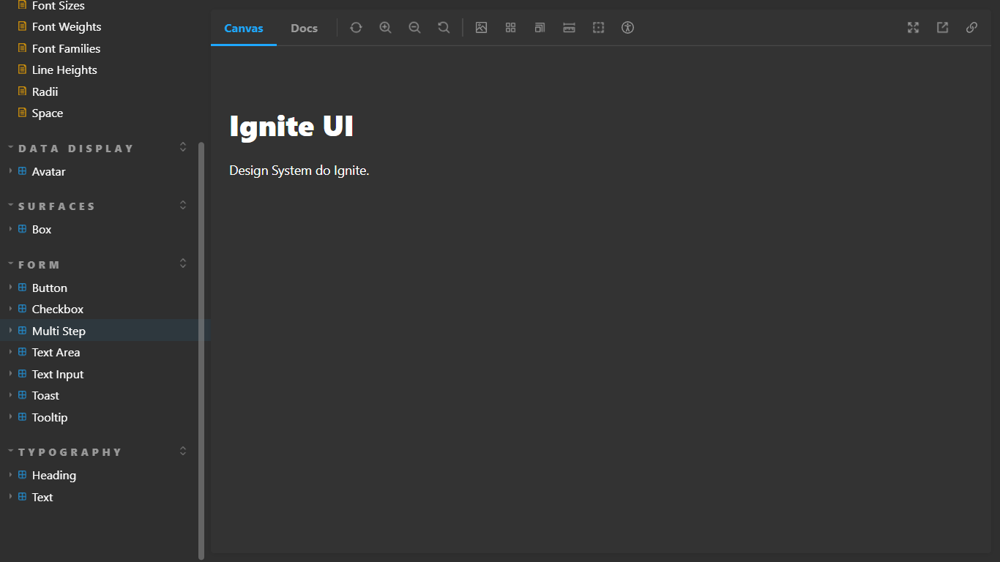

# Design System - Ignite 2022 - React JS

This is the last challenge of the bootcamp Ignite 2022. I had to do two components: 
* Toast component
* Tooltip component

To create the Toast and the Tooltip was used Radix UI. It is easy to implement, to use and to style it.

## Technolages used
* ReactJs
* NextJs
* TypeScript
* CSS (Stitches)
* Storybook
* Radix UI

## ScreenShot

## How can I use it?

### First
Check if you have the node and npm (comes with node) installed in your machine. To check, you must go to your terminal or command prompt and type:
> node -v

> npm -v

If shows the version, you are good to go. If not, go to https://nodejs.org/en/ and install the LTS version (it will install both node and npm).

### Second

If you don't have an IDE, install one of you preference. In my case, I used Visual Studio Code.

### Third

You clone the project. Use the commande line on your folder:
 > git clone https://github.com/Vinicius-PR/Challenge-05-Ignite-2022-Design-System.git

### Fourth
 
Open the folder using your IDE. Then, go to the terminal of your IDE and type the following command to install the dependencies: (or can go to the folder application using normal terminal and type the same command)
 > npm install
 
### Finally
 
To run the project, run the command:
 > npm run dev